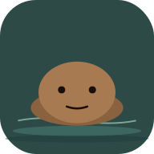

# Cami — Meditación con tu capibara 🌿

Un compañero capibara minimalista para encontrar calma cada día. PWA bilingüe (ES/EN) con respiración guiada, sonidos ambientales sintetizados y meditación a medida.

**Demo en vivo:** [robertoarroyo89.github.io/cami-app](https://robertoarroyo89.github.io/cami-app/)



## ✨ Características

- **Onboarding personalizado** — nombre, experiencia y objetivo principal
- **3 técnicas de respiración reales:**
  - Natural (observa sin cambiar)
  - Relajante (inspira 4 · espira 6)
  - 4-7-8 (inspira 4 · mantén 7 · espira 8)
- **Animación de respiración sincronizada** — el círculo se expande y contrae al ritmo exacto de cada fase
- **Meditación a medida** — escribe lo que sientes y la app genera 4 pensamientos guía
- **Sonidos ambientales sintetizados** con Web Audio API (lluvia, bosque, océano) — sin archivos externos
- **Calendario y estadísticas** — racha, minutos totales, días completados
- **Logros zen** — insignias por consistencia
- **Bilingüe** — español (por defecto) e inglés
- **Modo claro y oscuro**
- **PWA instalable** — funciona offline y se añade a pantalla de inicio

## 🛠️ Stack

JavaScript vanilla, HTML5, CSS3. Sin frameworks, sin build step, sin dependencias.

- Web Audio API para sonidos ambientales generativos
- localStorage para persistencia
- Service Worker para offline
- Tipografías: Poppins (UI) + Playfair Display (citas)

## 🚀 Cómo correr en local

```bash
git clone https://github.com/robertoarroyo89/cami-app.git
cd cami-app
python3 -m http.server 8080
```

Abre `http://localhost:8080` en el navegador.

## 📦 Deploy en GitHub Pages

1. Haz fork o sube este repo a tu cuenta de GitHub
2. Settings → Pages → Source: `Deploy from a branch` → `main` / `(root)`
3. Tu app estará en `https://[tu-usuario].github.io/cami-app/`

No requiere ninguna configuración de build. Es 100% estático.

## 📁 Estructura

```
cami-app/
├── index.html              # Shell de la app
├── styles.css              # Sistema de diseño completo
├── manifest.webmanifest    # Configuración PWA
├── sw.js                   # Service worker offline
├── assets/
│   ├── icon.svg            # Logo de la app (Cami en agua)
│   ├── icon-192.png
│   └── icon-512.png
└── js/
    ├── i18n.js             # Traducciones ES/EN
    ├── thoughts.js         # Pool de pensamientos guía
    ├── techniques.js       # Definición de técnicas de respiración
    ├── mascot.js           # SVG de Cami
    ├── audio.js            # Sonidos ambientales (Web Audio API)
    ├── storage.js          # localStorage + cálculo de racha
    ├── screens.js          # Render de cada pantalla
    └── app.js              # Estado, eventos, ciclo de respiración
```

## 🎨 Paleta

| Color | Hex |
|---|---|
| Verde-azulado profundo (fondo) | `#2d4a47` |
| Verde menta (acento) | `#9ed1bb` |
| Salvia (acento secundario) | `#7fb09b` |
| Texto sobre oscuro | `#eaf1ee` |

## 🐹 Sobre Cami

Cami es una capibara que flota tranquilamente en aguas serenas. Las capibaras son el símbolo perfecto de calma — el animal más relajado del mundo, conocido por llevarse bien con cualquier criatura. Cami te acompaña en cada pantalla como recordatorio de que la quietud es siempre posible.

## 📄 Licencia

MIT — úsalo, modifícalo, compártelo. Si haces algo bonito con esto, me encantaría verlo.

---

Hecho con cariño y mucho té, por [Roberto Arroyo](https://github.com/robertoarroyo89) 🌱
